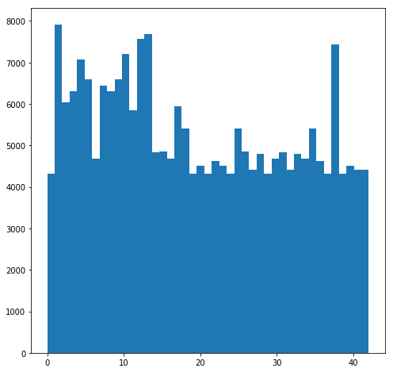

# **Traffic Sign Recognition** 

## Writeup

---

**Build a Traffic Sign Recognition Project**

The goals / steps of this project are the following:
* Load the data set (see below for links to the project data set)
* Explore, summarize and visualize the data set
* Design, train and test a model architecture
* Use the model to make predictions on new images
* Analyze the softmax probabilities of the new images
* Summarize the results with a written report

[//]: # (Image References)

[image1]: ./train_labels_hist.png "Labels Hist"
[image2]: ./original_image.png    "Original Image"
[image3]: ./image_with_noise.png  "Image with noise"
[image4]: ./German_traffic_signs/00009_00029.jpg "Traffic Sign 1"
[image5]: ./German_traffic_signs/00025_00025.jpg "Traffic Sign 2"
[image6]: ./German_traffic_signs/00023_00026.jpg "Traffic Sign 3"
[image7]: ./German_traffic_signs/00000_00014.jpg "Traffic Sign 4"
[image8]: ./German_traffic_signs/00012_00018.jpg "Traffic Sign 5"

## Rubric Points
### Here I will consider the [rubric points](https://review.udacity.com/#!/rubrics/481/view) individually and describe how I addressed each point in my implementation.  

---

You're reading it! and here is a link to my [project code](https://github.com/ronhuafeng/CarND-Traffic-Sign-Classifier-Project/blob/master/Traffic_Sign_Classifier.ipynb)

### Data Set Summary & Exploration

#### 1. Provide a basic summary of the data set. In the code, the analysis should be done using python, numpy and/or pandas methods rather than hardcoding results manually.

I calculated summary statistics of the traffic
signs data set:

* The size of training set is 34799
* The size of the validation set is 4410
* The size of test set is 12630
* The shape of a traffic sign image is 32*32
* The number of unique classes/labels in the data set is 43

#### 2. Include an exploratory visualization of the dataset.

Here is an exploratory visualization of the data set. It is a bar chart showing how the training data is distributed. There are 43 different kinds of traffic signs. How ever the numbers of each sign in the training dataset are biased. So I choose to generate more images for the sign with less training examples.

![alt text][image1]

### Design and Test a Model Architecture

#### 1. Describe how you preprocessed the image data. What techniques were chosen and why did you choose these techniques? Consider including images showing the output of each preprocessing technique. Pre-processing refers to techniques such as converting to grayscale, normalization, etc. (OPTIONAL: As described in the "Stand Out Suggestions" part of the rubric, if you generated additional data for training, describe why you decided to generate additional data, how you generated the data, and provide example images of the additional data. Then describe the characteristics of the augmented training set like number of images in the set, number of images for each class, etc.)

I add noise to the group of images whose count is less than 4000.

Original image:

![alt text][image2]

Image with noise

![alt text][image3]

After augmenting the training dataset, now the distribution of training dataset is:

#### 2. Describe what your final model architecture looks like including model type, layers, layer sizes, connectivity, etc.) Consider including a diagram and/or table describing the final model.

My final model consisted of the following layers:

| Layer                     | Description                                            |
| :-----------------------: | :----------------------------------------------------: |
| Input                     | 32x32x3 RGB image                                      |
| Convolution 5x5 (conv_1)  | 1x1 stride, valid padding, outputs 28x28x6             |
| RELU            (conv_1)  |                                                        |
| Max pooling     (conv_1)  | 2x2 stride,  outputs 14x14x6                           |
| Convolution 5x5 (conv_2)  | 1x1 stride, valid padding, outputs 10x10x24            |
| Max pooling     (conv_2)  | 2x2 stride,  outputs 5x5x24                            |
| RELU            (conv_2)  |                                                        |
| Convolution 9x9 (conv_12) | 1x1 stride, valid padding, outputs 24x24x6             |
| RELU            (conv_12) |                                                        |
| Max pooling     (conv_12) | 2x2 stride,  outputs 12x12x6                           |
| Convolution 5x5 (conv_22) | 1x1 stride, valid padding, outputs 8x8x24              |
| Max pooling     (conv_22) | 2x2 stride,  outputs 4x4x24                            |
| RELU            (conv_22) |                                                        |
| Fully connected           | concat(flatten(conv_2), flatten(conv_22)), outputs 400 |
| RELU                      |                                                        |
| Fully connected           | outputs 120                                            |
| RELU                      |                                                        |
| Fully connected           | outputs 84                                             |
| RELU                      |                                                        |
| Fully connected           | outputs 43                                             |
| RELU                      |                                                        |
| Softmax                   | 43                                                     |
 

#### 3. Describe how you trained your model. The discussion can include the type of optimizer, the batch size, number of epochs and any hyperparameters such as learning rate.

To train the model, I used an AdamOptimizer, an batch size of 256, 20 epochs and an learning rate of 0.001.

#### 4. Describe the approach taken for finding a solution and getting the validation set accuracy to be at least 0.93. Include in the discussion the results on the training, validation and test sets and where in the code these were calculated. Your approach may have been an iterative process, in which case, outline the steps you took to get to the final solution and why you chose those steps. Perhaps your solution involved an already well known implementation or architecture. In this case, discuss why you think the architecture is suitable for the current problem.

My final model results were:
* training set accuracy of 0.991
* validation set accuracy of 0.933 
* test set accuracy of 0.919

I use the basic LeNet architecture at the beginning, but the validation accuracy is low. So I augment the training dataset to make it not as biased as provided. 

From a video provided in this course, I add another convolutional layer of 9*9 which is like the concept of inception module. By this way, the training accuracy is promoted.
 

### Test a Model on New Images

#### 1. Choose five German traffic signs found on the web and provide them in the report. For each image, discuss what quality or qualities might be difficult to classify.

Here are five German traffic signs that I found on the web:

![alt text][image4] ![alt text][image5] ![alt text][image6] 
![alt text][image7] ![alt text][image8]

The 4th image might be difficult to classify because I can hardly recognize it by my eyes.

The resolution of these images is 80x80. I resize them to 32x32. 

#### 2. Discuss the model's predictions on these new traffic signs and compare the results to predicting on the test set. At a minimum, discuss what the predictions were, the accuracy on these new predictions, and compare the accuracy to the accuracy on the test set (OPTIONAL: Discuss the results in more detail as described in the "Stand Out Suggestions" part of the rubric).

Here are the results of the prediction:

| Image                   | Prediction              |
| :---------------------: | :---------------------: |
| 23, Slippery road       | 23, Slippery road       |
| 18, General caution     | 18, General caution     |
| 7,Speed limit (100km/h) | 7,Speed limit (100km/h) |
| 26,Traffic signals      | 26,Traffic signals      |
| 14,Stop                 | 14,Stop                 |

The model was able to correctly guess 5 of the 5 traffic signs, which gives an accuracy of 100%.

#### 3. Describe how certain the model is when predicting on each of the five new images by looking at the softmax probabilities for each prediction. Provide the top 5 softmax probabilities for each image along with the sign type of each probability. (OPTIONAL: as described in the "Stand Out Suggestions" part of the rubric, visualizations can also be provided such as bar charts)

The code for making predictions on my final model is located in the 22th cell of the Ipython notebook.

For the first image, the model is very sure that this is a slippery road sign (probability of 1.0). The top five soft max probabilities were

| Probability | Prediction           |
| :---------: | :------------------: |
| 1.0         | Slippery road        |
| 0.0         | Speed limit (20km/h) |
| 0.0         | Speed limit (30km/h) |
| 0.0         | Speed limit (50km/h) |
| 0.0         | Speed limit (60km/h) |

Since the label of the other 4 images are all predicted correctly with a high confidence by the model, I will not list the top five soft max probabilities for them.

For the second image, the model is very sure that this is a general caution sign (probability of 0.999). 

For the third image, the model is very sure that this is a speed limit (100km/h)  sign (probability of 1.0). 

For the fourth image, the model is very sure that this is a traffic signals  sign (probability of 1.0). 

For the fifth image, the model is very sure that this is a stop sign (probability of 1.0).

### (Optional) Visualizing the Neural Network (See Step 4 of the Ipython notebook for more details)
#### 1. Discuss the visual output of your trained network's feature maps. What characteristics did the neural network use to make classifications?

